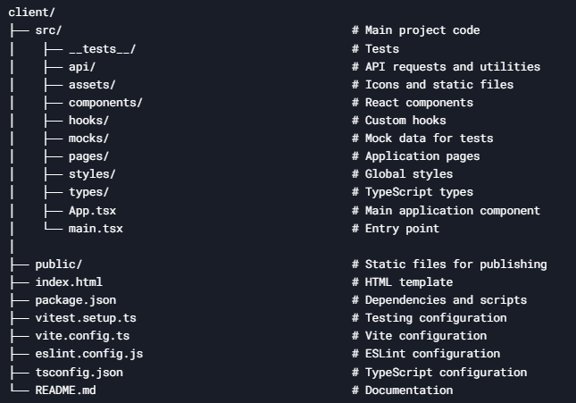

# Test Dashboard

The project is a dashboard for displaying and managing test data. It includes a table with the ability to sort data by various columns, filter data, and display data status.

## Key Features

- **Data Sorting**: Ability to sort data by columns (Name, Type, Status, Site).
- **Data Filtering**:  Search data by keywords.
- **Status Display**: Data is displayed according to its current status (Draft, Online, Paused, Stopped).

## Dependencies

- **React**: Library for building user interfaces.
- **React DOM**: DOM rendering for React.
- **React Router DOM**: Routing for React applications.
- **Classnames**: Utility for conditionally joining class names.

## Development Dependencies

- **Vite**: Fast build tool and development server.
- **Vitest**: Testing framework.
- **ESLint**: Linting tool for JavaScript/TypeScript.
- **TypeScript**: Static type checking.
- **MSW (Mock Service Worker)**: API mocking for tests.
- **Sass**: CSS preprocessor for styling.
- **Testing Library**: Utilities for testing React components.

## Available Scripts

- **`pnpm dev`**: Start the development server.
- **`pnpm build`**: Build the project for production.
- **`pnpm lint`**: Run ESLint to check code quality.
- **`pnpm preview`**: Preview the production build locally.
- **`pnpm test`**: Run all tests.
- **`pnpm test:watch`**: Run tests in watch mode.
- **`pnpm test:coverage`**: Run tests and generate coverage report.

## Installation

1. Ensure you have [Node.js](https://nodejs.org/) (version 16 or higher) and [PNPM](https://pnpm.io/).

2. Clone the repository:

   ```bash
   git clone https://github.com/veluat/test-dashboard.git
   cd test-dashboard/client
   ```
   
3. Install dependencies:

   ```bash
   pnpm install
   ```

## Running the Project
1. Start the project in development mode:

   ```bash
   pnpm run dev
   ```
   
2. Open your browser and navigate to:

   ```bash
   http://localhost:5173
   ```
   
3. (Optional) If you need to start the server, use the command:

   ```bash
   npm start
   ```
   
## Testing

**To run tests, use the command:**

   ```bash
   pnpm test
   ```

**Tests include:**

- Unit tests for hooks (e.g., useSortedData, useFetchData).

- Integration tests for components (e.g., Dashboard).

## Test Coverage

To check test coverage, run:

   ```bash
   pnpm test:coverage
   ```
This will generate a coverage report in the coverage/ directory.


## Linting

- **Linting**: Run ESLint to check for code issues:

  ```bash
  pnpm lint
   ```

## Project Structure



